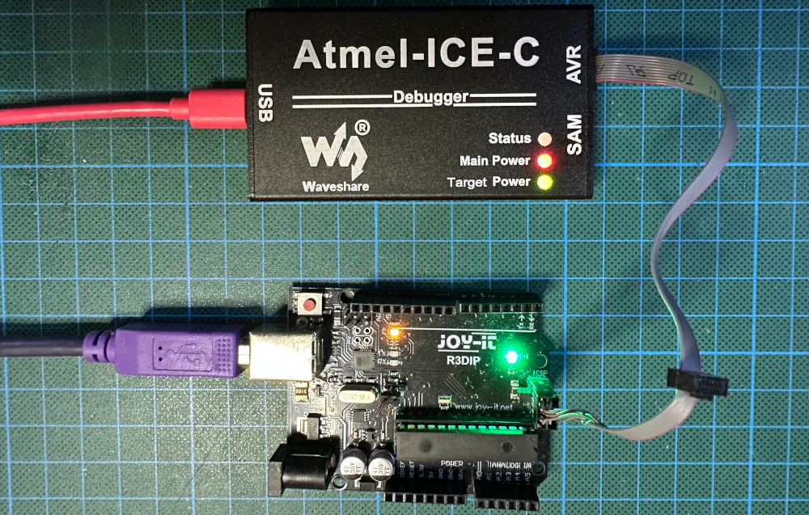
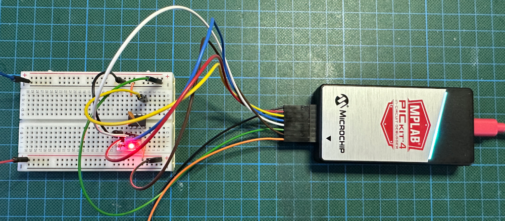

# How to Connect a DebugWIRE Debugger to a Target

In principle, only two lines are necessary to connect your hardware debugger to a target chip or board: the debugWIRE line, which is the target chip's RESET line, and GND. However, when one wants to change into and out of debugWIRE mode, change fuses, or upload firmware, it is necessary to connect all 6 SPI programming lines to the target: VTG, GND, RESET, MOSI, MISO, and SCK. For this reason, using all SPI programming lines makes a lot of sense. Moreover, most of the time, an SPI connector is already on the target board.

## SPI programming header

There are two types of SPI programming connectors. The more recent type has six pins, and the older type has 10 pins, as shown in the following diagram (based on a diagram from Wikipedia https://commons.wikimedia.org/wiki/user:Osiixy), which provides a top view of the headers on a PCB.

Note the notches on the left side of the headers. Since almost all SPI programming plugs are keyed, you can only plug them in in the correct orientation. However, the headers sometimes do not have notches. In this case, pin 1 is usually marked in some way, either with a dot, a star, or with the number 1. Similarly, plugs also come unkeyed. In this case, again, pin 1 is marked in some way.

## Connecting to targets with an SPI programming header

If the target board has an SPI programming header, it is easy to connect to it. **Atmel-ICE**, **Power Debugge**r, and **JTAGICE3** have a cable you can plug into a 6-pin SPI programming header. If you only have a 10-pin header on the target, you need an adapter. **PICKit4** and **SNAP** do not come with SPI programming headers. However, you can buy an AVR programming adapter from Microchip, an [adapter PCB from OSH Park](https://oshpark.com/shared_projects/eZiws6Jb), or [a more luxurious version from eBay](https://www.ebay.de/itm/186561251300). Finally, for **dw-link**, I propose preparing a [modified SPI programming cable](https://arduino-craft-corner.de/index.php/2022/01/13/a-debugwire-hardware-debugger-for-less-than-10-e/) or buying the [dw-link probe programmer shield](https://www.tindie.com/products/fogg/dw-link-probe-a-debugwire-hardware-debugger/), which has an SPI programming header on board.

When using one of the commercial debuggers, you need to power the target board from an external source. With dw-link, you can choose to power the target board from the debugger or an external source.

## Connecting to targets without an SPI programming header

If the target does not feature an SPI programming header, you need to connect 6 cables. Instead, if you are working with a breadboard, you may consider buying an SPI header breadboard adapter. Otherwise, you need to connect each pin individually.  **Atmel-ICE**, **Power Debugge**r, and **JTAGICE3** have a so-called 10-pin mini-squid cable. The pin mapping for those debuggers is as follows.

| Atmel Debugger | Mini-squid pin | Target pin | SPI pin |
| -------------- | -------------- | ---------- | ------- |
| Pin 1 (TCK)    | 1              | SCK        | 3       |
| Pin 2 (GND)    | 2              | GND        | 6       |
| Pin 3 (TDO)    | 3              | MISO       | 1       |
| Pin 4 (VTG)    | 4              | VTG        | 2       |
| Pin 5 (TMS)    | 5              | &nbsp;     | &nbsp;  |
| Pin 6 (nSRST)  | 6              | RESET      | 5       |
| Pin  (N.C.)    | 7&nbsp;        | &nbsp;     | &nbsp;  |
| Pin 8 (nTRST)  | 8              | &nbsp;     | &nbsp;  |
| Pin 9 (TDI)    | 9              | MOSI       | 4       |
| Pin 10 (GND)   | 0              | &nbsp;     | &nbsp;  |

For **PICkit4** and **SNAP**, such a table looks as follows, with pin 1 marked by a triangle.

| MBLAP Debugger | Pin # | Target pin | SPI pin |
| -------------- | ----- | ---------- | ------- |
| Pin 1 (TVPP)   | 1     | &nbsp;     | &nbsp;  |
| Pin 2 (TVDD)   | 2     | VTG        | 2       |
| Pin 3 (GND)    | 3     | GND        | 6       |
| Pin 4 (PGD)    | 4     | MISO       | 1       |
| Pin 5 (PGC)    | 5     | SCK        | 3       |
| Pin 6 (TAUX)   | 6     | RESET      | 5       |
| Pin 7 (TTDI)   | 7     | MOSI       | 4       |
| Pin 8 (TTMS)   | 8     | &nbsp;     | &nbsp;  |

When you want to connect a **dw-link** debugger without a dw-link probe shield to a target, you can use jumper cables using the following pin mapping.

| dw-link Arduino Uno pins    | Target pin | SPI pin |
| --------------------------- | ---------- | ------- |
| D8                          | RESET      | 5       |
| D11                         | MOSI       | 4       |
| D12                         | MISO       | 1       |
| D13                         | SCK        | 3       |
| 5V (if powered by debugger) | Vcc        | 2       |
| GND                         | GND        | 6       |

 When you have a dw-link probe shield, it is best to construct or buy a cable with a 6-pin SPI programming plug on one end and single DuPont pins on the other.

